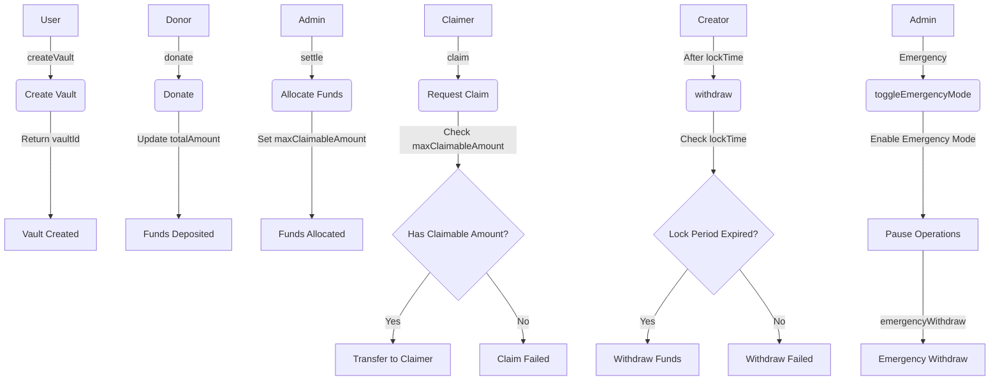

# SharingWishVault

`SharingWishVault` 是一个基于以太坊的智能合约，用于管理愿望分享和资金分配。它允许用户创建愿望资金库（`Vault`），接受捐赠，并通过管理员（`Admin`）审核后分配资金给指定的接收者（`Claimer`）。

## 合约地址

### Optimism Sepolia 网络

| 合约名称         | 地址                                         |
| ---------------- | -------------------------------------------- |
| SharingWishVault | `0x9be5488189d1bBD2E409790252da4Fc627c5d904` |
| MockERC20        | `0x23bb951AE6408Aa12e9A228C5ec1377721017FcC` |

## 主要特性

1. **Vault 创建**

    - 用户可以创建带有消息的 Vault
    - 支持 `ETH` 和指定的 `ERC20` 代币
    - 每个 Vault 都有唯一的 `ID` 和锁定期

2. **资金管理**

    - 支持多人向 Vault 捐赠（`donate`）
    - 资金锁定期（`lockTime`）为 14 天
    - 创建者可在锁定期后提取（`withdraw`）未分配的资金

3. **资金分配**

    - 管理员可以设置资金接收者（`settle`）
    - 支持多次分配和领取
    - 接收者可以随时领取（`claim`）已分配的资金

4. **安全特性**
    - 紧急模式（`Emergency Mode`）开关
    - 管理员紧急提款功能
    - 防重入（`ReentrancyGuard`）保护
    - 支持的代币白名单

## 合约接口

### 核心功能

1. **创建 Vault**

```solidity
function createVault(string calldata message, address token, uint256 lockDuration) external returns (uint256 vaultId)
```

-   创建新的 Vault
-   参数：消息内容、指定接受代币地址（`token`）和锁定期（`lockDuration`）
-   返回：`Vault ID`

2. **捐赠资金**

```solidity
function donate(uint256 vaultId, uint256 amount) external payable
```

-   向指定 Vault 捐赠资金
-   支持 `ETH` 和 `ERC20` 代币

3. **分配资金**

```solidity
function settle(uint256 vaultId, address claimer, uint256 amount) external
```

-   管理员分配资金给指定接收者（`Claimer`）
-   可以多次分配

4. **领取资金**

```solidity
function claim(uint256 vaultId) external
```

-   接收者领取已分配的资金

5. **提取资金**

```solidity
function withdraw(uint256 vaultId, uint256 amount) external
```

-   创建者在锁定期后提取未分配资金

### 查询功能

1. **查询已领取金额**

```solidity
function getClaimedAmount(uint256 vaultId, address claimer) external view returns (uint256)
```

-   查询指定接收者已领取的金额（`claimedAmount`）

2. **查询最大可领取金额**

```solidity
function getMaxClaimableAmount(uint256 vaultId, address claimer) external view returns (uint256)
```

-   查询指定接收者可领取的最大金额（`maxClaimableAmount`）

### 管理功能

1. **代币白名单管理**

```solidity
function addAllowedToken(address token) external
function removeAllowedToken(address token) external
function isAllowedToken(address token) external view returns (bool)
```

2. **紧急功能**

```solidity
function toggleEmergencyMode() external
function emergencyWithdraw(uint256 vaultId, uint256 amount) external
```

## FLow



## Events

1. `VaultCreated`: Vault 创建事件
2. `FundsDonated`: 资金捐赠事件
3. `VaultSettled`: 资金分配事件
4. `FundsClaimed`: 资金领取事件
5. `FundsWithdrawn`: 资金提取事件
6. `EmergencyModeToggled`: 紧急模式切换事件

## Errors

-   `InvalidVaultId`: 无效的 Vault ID
-   `EmergencyModeActive`: 紧急模式已激活
-   `EmergencyModeNotActive`: 紧急模式未激活
-   `InsufficientBalance`: 余额不足
-   `InvalidClaimer`: 无效的接收者地址
-   `NoFundsToClaim`: 无可领取资金
-   `LockPeriodNotExpired`: 锁定期未到
-   `ETHTransferFailed`: ETH 转账失败
-   `ExceedsTotalAmount`: 超出总金额
